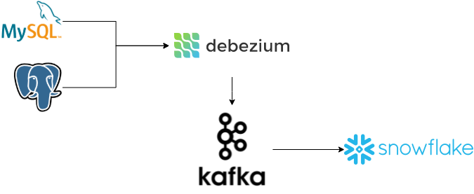

# Howto - Debezium to Snowflake

This repo is a demo of how to use Debezium to capture changes over tables in MySQL and PosgreSQL 
to generate a replica in near real time in Snowflake. This is extensible to other databases and
describe serveral common points about CDC, Kafka, Kafka connect or Snowflake tools. 

[Miguel García](https://dzone.com/users/4531976/miguelglor.html) and me work together in an article
using this repo as demo: https://dzone.com/articles/data-platform-building-an-enterprise-cdc-solution

