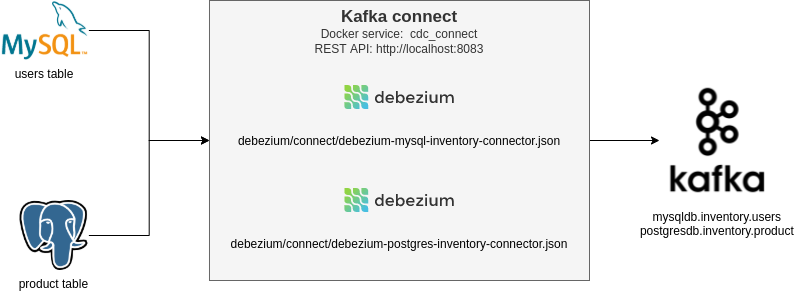
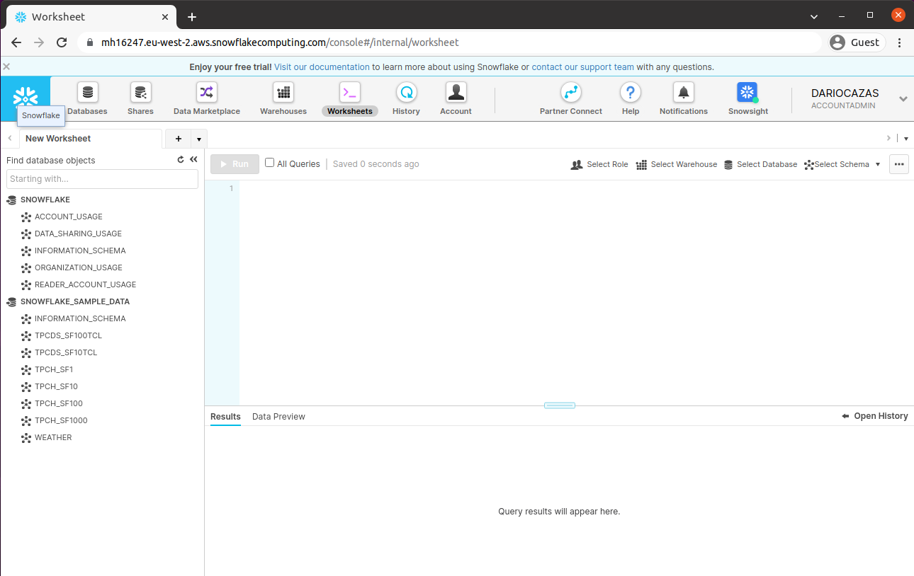
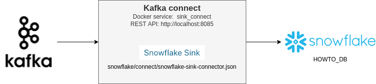

# Introduction

This article is a follow-up to the [Data Platform: Building an Enterprise CDC Solution](https://dzone.com/articles/data-platform-building-an-enterprise-cdc-solution), where [Miguel García](https://dzone.com/articles/data-platform-building-an-enterprise-cdc-solution) and I describe:

* From several CDC (Change Data Capture) use cases and common scenarios in an enterprise platform.
* Until a proposal using Debezium (as log-based CDC) to capture data from the relational databases, and Kafka like a channel that enables several consumers to propagate data changes for different use cases.

One of the common scenarios for this type of solution consists of the replication of information from OLTP Database to OLAP Database (from the operational database to the data warehouse), and a simplified version of this solution is the content of this article.

With it in mind, this selection, the howto provides:

* CDC process from two different relational databases, and manage the data changes in a common format
* Kafka connect to get external data (using Debezium) and puts the data to external services (using Snowflake)
* Replication logic from change events in Snowflake (but extrapolate to another system), avoiding the use of JDBC connector for better cost-effectiveness.


# Step-by-step

In the GitHub repository, we have a detailed description as well as several scripts that you need to follow this howto. For this reason, the start of this step-by-step is this command:

```sh
git clone https://github.com/dariocazas/howto-debezium-to-snowflake.git
```

Every folder in this repository has a README file with more info about the process.

## Start local services

The repository contains a docker-compose to run in your local environment several services:
* Two database engines: MySQL and PostgreSQL
* One Kafka broker (and his zookeeper)
* Two Kafka connect services: one to run CDC Debezium tasks and another to send the events to Snowflake


As requirements to run it, you need [docker-compose](https://docs.docker.com/compose/install/) and [docker engine 1.10.0](https://docs.docker.com/engine/) or later.

All the docker commands referenced in this howto need to be run inside of services folder. To start it, run these commands (can take several minutes to download dependencies and proceed to the first run)
```sh
cd services
docker-compose up
```

To stop it, with Crtl+C in your shell is enough.

## Prepare your tables 

We go to work with two tables (one for each database engine): USERS table in MySQL and PRODUCT in PostgreSQL.

To init the database you can run: 
```sh
cd database
# Create the tables in each database engine
./init_db.sh
# Run several CRUD operations in MySQL and show the final data
./mysql_crud.sh
# Run several CRUD operations in PostgreSQL and show the final data
./postgres_crud.sh
```

We can show the content of the tables at any time using:

```sh
# To run docker commands, always go to the services folder
cd services

echo "SELECT * FROM users ORDER BY id" | docker-compose -f docker-compose.yml \
    exec -T mysql \
    bash -c 'mysql -u $MYSQL_USER -p$MYSQL_PASSWORD inventory'

echo "SELECT * FROM product ORDER BY id" |  docker-compose -f docker-compose.yml \
    exec -T postgres \
    env PGOPTIONS="--search_path=inventory" \
    bash -c 'psql -U $POSTGRES_USER postgres'
```

## Capture data to Kafka with Debezium



The cdc_connect service has all dependencies needed to run Debezium. The repository provides three scripts to manage the sink:

```sh
cd debezium
./init_cdc.sh
# After start, you can use ./status_cdc.sh to check task status
# To stop it, you can use ./delete_cdc.sh
```

Use the init_sink.sh to dump the actual databases to Change Events in Kafka, and start tracking the new changes in the database. You can see the events available in Kafka using this script:

```sh
cd services

# List topics
docker-compose -f docker-compose.yml exec kafka /kafka/bin/kafka-topics.sh --bootstrap-server kafka:9092 --list

# Show all CDC MySQL data (including keys for the events). Use Ctrl+C to stop it
docker-compose -f docker-compose.yml exec kafka /kafka/bin/kafka-console-consumer.sh \
    --bootstrap-server kafka:9092 --from-beginning \
    --topic mysqldb.inventory.users

# Show all CDC MySQL data (including keys for the events and timestamp which the event was received in Kafka)
docker-compose -f docker-compose.yml exec kafka /kafka/bin/kafka-console-consumer.sh \
    --bootstrap-server kafka:9092 --from-beginning \
    --topic mysqldb.inventory.users \
    --property print.key=true --property print.timestamp=true

# Show all CDC Posgres data. Use Ctrl+C to stop it
docker-compose -f docker-compose.yml exec kafka /kafka/bin/kafka-console-consumer.sh \
    --bootstrap-server kafka:9092 --from-beginning \
    --topic postgresdb.inventory.product
```


And using this, you can generate new change events in the topics:
```sh
cd database
# Run several CRUD operations in MySQL and show the final data
./mysql_crud.sh
# Run several CRUD operations in PostgreSQL and show the final data
./postgres_crud.sh
```


## Snowflake Account

We generate a table replication in a new generation of data warehouses and select Snowflake as the target. To run this howto, you can create a free trial account from https://signup.snowflake.com using a **Standard Edition** over the cloud provider as you prefer. Snowflake sends you a validation email which you can use to register your user.



With the standard edition trial, you access to Snowflake worksheet using an URL like https://mh16247.eu-west-2.aws.snowflakecomputing.com/console#/internal/worksheet and the hostname (in this case, mh16247.eu-west-2.aws.snowflakecomputing.com) **is what you need to connect from the tools to Snowflake**.

### Snowflake authentication

The other important thing to connect to Snowflake is the authentication mechanism, and in our case, we need to work with **key-pair authentication**. The detailed process is documented [here](https://docs.snowflake.com/en/user-guide/key-pair-auth.html#configuring-key-pair-authentication) or you can use directly the provided by this repository (the configs and script of this howto using it):

* Private key encrypted: snowflake/keys/snowflake_rsa_key.p8
* Private passphrase to decrypt: mypassphrase
* Public key: snowflake/keys/snowflake_rsa_key.pub

As the next step, in the Snowflake Worksheet, we need to **register the public key** (replace in this script the content of your snowflake/keys/snowflake_rsa_key.pub without header and footer)

```sql
USE ROLE ACCOUNTADMIN; -- Should use SECURITYADMIN role for this action, but for this user you need an ACCOUNTADMIN role
ALTER USER dariocazas SET rsa_public_key='MIIBIjANBgkqhkiG9w0BAQEFAAOCAQ8AMIIBCgKCAQEAwBwYbPtbEUXueQ6u3KDw
zlKu4IhAkGdcUBVbdTdUVBLNVsZX+eiKOedN3EnMtDeVzRlaT8JAwHX0LVXkgXtn
KzMBp6TpS4j+2kKvbZc5p0KfZHjn42G+C/DXI4ZNQZEBQ/Q4UY6OkTZepFaOX3ev
2icxB6LnnVYI3WHkSnq3vTthhYhTuUOQ4YRudadOtoT4By09hxbsaanVl42FXIZP
AXX1jwawzKe52V1+FB5/UMv+JMUFfczlO+acn/EaZvKbR55Vk/+OVrUP4KIKvdWn
s/n4ASYqxiw9xjrizGCoUyl+b+Ch6A02fTU02HrT9jOOj+dVAeFD2QGOqaze0eCD
dwIDAQAB';
```

### Snowflake roles and database

Well, is not a good option use the user with your ACCOUNTADMIN role to populate data in Snowflake, but in this howto will not cover the alternative to keep it more simple.
In the next steps, your role needs privileges to execute tasks in Snowflake. We will use the SYSADMIN role for it, and we need to apply for grants using:

```sql
USE ROLE ACCOUNTADMIN;
GRANT EXECUTE TASK ON ACCOUNT TO ROLE SYSADMIN;
```

At last, create the database where we work in the howto:

```sql
USE ROLE SYSADMIN;
CREATE DATABASE HOWTO_DB;
```

## From Kafka to Snowflake



We have:
* Kafka topics with Debezium events
* Snowflake account with HOWTO_DB database
* User account and secrets to access it

You should review in snowflake/connect/snowflake-sink-connector.json the Snowflake Sink Connection fields:
* snowflake.url.name: as described when we create the Snowflake Account
* snowflake.private.key: use the content of your private key encrypted
* snowflake.private.key.passphrase: used to encrypt the private key

The repository provides three scripts to manage the sink:

```sh
cd snowflake
./init_sink.sh
# After start, you can use ./status_sink.sh
# To stop it, you can use ./delete_sink.sh
```

Use it to start the upload from Kafka to Snowflake. The connector will create the tables when uploading the first events, using the property "snowflake.topic2table.map" as name mapping. To validate it you can execute this shell script:

```sh
cd database
./mysql_crud.sh
./postgres_crud.sh
```

And review when the new tables are created and populated with data:

```sql
USE ROLE ACCOUNTADMIN; -- You probably need this by simplifying the management of roles in the howto
SELECT * FROM "HOWTO_DB"."PUBLIC"."CDC_MYSQL_INVENTORY_USERS"; -- One row per event in Kafka topic mysqldb.inventory.users
SELECT * FROM "HOWTO_DB"."PUBLIC"."CDC_POSTGRESDB_INVENTORY_PRODUCT"; -- One row per event in Kafka topic postgresdb.inventory.product
```

## Change events table to replica tables

We have two change event tables, one with data from our MySQL database and another from PostgreSQL. In the repository, we provide two SQL scripts to generate a replica view for each table and all needed Snowflake resources. The steps that follow these SQL scripts are:

* Create a table to store the last event for each entity of your model (the replica table)
* Create a view from this replica table that only shows the entity like the source database, not the columns of metadata used in the consolidation process
* Create a stream to cache the new change events sent by the Snowflake Sink Connector
* A MERGE sentence that fills the replica table from all data of the change events table. This query has a dependency of the source database engine to order the events using the source database sequence (binlog position for MySQL, and LSN for PostgreSQL)
* A task, triggered by time, that check if exist new data in the stream and update the replica table from the stream (not from all change events table)
* Enable the task execution (remember, you need EXECUTE TASK privilege)
* Some useful queries like check task execution history and or some stats about the number of events in change events table an replica table

After running the previous steps and we have the change events in Snowflake, then you can run snowflake/sql/01-cdc-to-replica-mysql.sql and snowflake/sql/01-cdc-to-replica-postgres.sql in Snowflake Worksheet to create and configure these Snowflake resources.

To validate it, you can run this shell script to get the content of the MySQL table:

```sh
cd services
echo "SELECT * FROM users ORDER BY id" | docker-compose -f docker-compose.yml \
    exec -T mysql \
    bash -c 'mysql -u $MYSQL_USER -p$MYSQL_PASSWORD inventory'
```

And compare with the Snowflake replica table in the Snowflake Worksheet:
```sql
SELECT * FROM "HOWTO_DB"."PUBLIC"."MYSQL_INVENTORY_USERS" ORDER BY ID;
```

The same to check PostgreSQL:
```sh
cd services
echo "SELECT * FROM product ORDER BY id" |  docker-compose -f docker-compose.yml \
    exec -T postgres \
    env PGOPTIONS="--search_path=inventory" \
    bash -c 'psql -U $POSTGRES_USER postgres'
```

```sql
SELECT * FROM "HOWTO_DB"."PUBLIC"."POSTGRESDB_INVENTORY_PRODUCT" ORDER BY ID;
```

You can add new CRUD operations in the source database and validate the results in Snowflake using this script (remember that the Snowflake Sink Connector add a delay, the replication task is configured to run each minute, and the solution has eventually consistence: the events may be sended/process in Snowflake in order, but not in the same batch) 

```sh
cd database
./mysql_crud.sh
./postgres_crud.sh
```

# Conclusions

**Debezium provides an easy way to capture changes from databases** and populate change events in a Kafka service, that you can use to consume for several ways. 

To populate these changes to another database you can use the simplest way, but this is not always the better option **in the context of the new generation of data warehouses**, and probably you need to **take into account another kind of strategiy closed to this service** for better performance and reduce the cost of use.

First of all, study the possibilities, and after **test it with a POC similar to this howto**, including some aspects like performance and cost review, **and proceed to do the next** (security, naming, automatization, data quality, failover, ...)