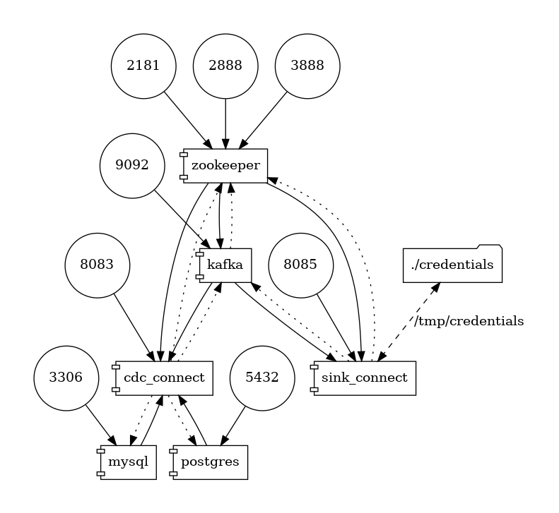

# Howto - Docker compose description

As part of this howto, I provide:

- A docker-compose to run it
- `credentials` folder with Snowflake keys
- `.env` file with product versions

## Docker-compose detail

The compose YML run several images and expose several ports. For simplicity, I use debezium images for many parts:

- **mysql**: database instance provided by debezium team
- **postgres**: database instance provide by debezium team
- **zookeeper**: as part of Kafka ecosystem
- **kafka**: single kafka broker, exposing his 9092 port
- **cdc_connect**: kafka connect worker node, provided by debezium team, with the connector plugins for his supported databases
- **sink_connect**: kafka connect worker node, provided by confluent. I include the installation of snowflake connector plugin



## Credentials folder

The `credentials` folder store the public and private key used in `sink_connect` to upload data to Snowflake. 
Review the [README](./credentials/README.md) inside of this folder to configure your own Snowflake account.


## Usage

You can run it with a single command, and see all logs in your terminal. Clone this repository and go to docker folder to run it
```sh
git clone https://github.com/dariocazas/howto-debezium-to-snowflake.git
cd docker
docker-compose up
```

You can stop this using `Ctrl+C`

Return to global [README](../README.md) to check next steps.

## Access to containers

Inside of docker-compose file, you can see several commands to enable access to the containers.
You can run this commands inside `docker` folder (to enable docker to read the `.env` file)

### Kafka commands

```sh
# List topics
docker-compose -f docker-compose.yml exec kafka /kafka/bin/kafka-topics.sh --bootstrap-server kafka:9092 --list

# Show all CDC MySQL data (including keys for the events)
docker-compose -f docker-compose.yml exec kafka /kafka/bin/kafka-console-consumer.sh \
    --bootstrap-server kafka:9092 --from-beginning \
    --topic mysqldb.inventory.users

# Show all CDC MySQL data (including keys for the events and timestamp which the event was received in Kafka)
docker-compose -f docker-compose.yml exec kafka /kafka/bin/kafka-console-consumer.sh \
    --bootstrap-server kafka:9092 --from-beginning \
    --topic mysqldb.inventory.users \
    --property print.key=true --property print.timestamp=true

# Show all CDC Posgres data
docker-compose -f docker-compose.yml exec kafka /kafka/bin/kafka-console-consumer.sh \
    --bootstrap-server kafka:9092 --from-beginning \
    --topic mysqldb.inventory.product
```

### Database commands

```sh
# Access to MySQL shell
docker-compose -f docker-compose.yml exec mysql \
    bash -c 'mysql -u $MYSQL_USER -p$MYSQL_PASSWORD inventory'

# Access to Postgres shell
 docker-compose -f docker-compose.yml exec postgres \
    env PGOPTIONS="--search_path=inventory" \
    bash -c 'psql -U $POSTGRES_USER postgres'
```

# References

- [Debezium tutorial](https://debezium.io/documentation/reference/1.6/tutorial.html)
- [Debezium images github](https://github.com/debezium/docker-images)
- [Confluent: kafka connect zero to hero](https://github.com/confluentinc/demo-scene/tree/master/kafka-connect-zero-to-hero)
- [Docker compose graph visualization](https://github.com/pmsipilot/docker-compose-viz)